<div align="center">


# Money Insighter

### Your money, on your machine.

A personal-finance desktop app for Canadian banking, built on Plaid.<br>
Connect your banks and everything syncs into a Postgres database in your own
user folder.<br>
There is no server of ours — because there is no server of ours to have.

[**▶ Open the interactive tour**](https://xuckless.github.io/money-insighter/) · [Download a build](https://github.com/xuckless/money-insighter/releases) · [Set it up](#-set-it-up-in-five-minutes)


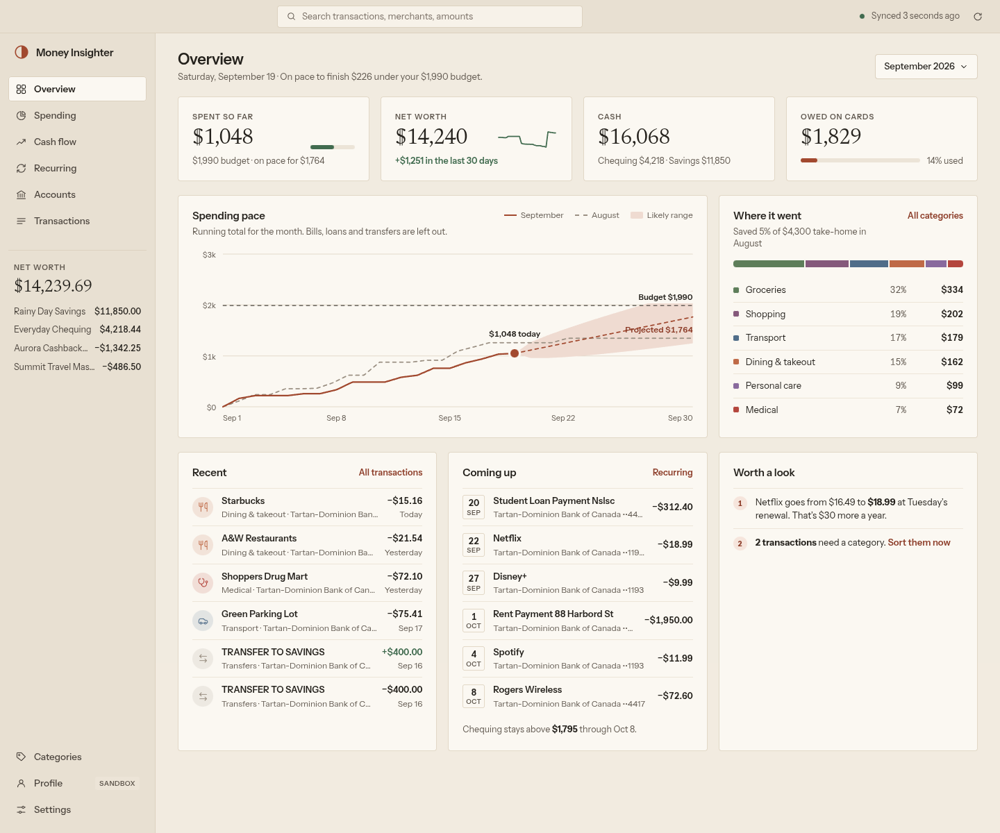

</div>

> [!NOTE]
> Every screenshot here is the real app, photographed by a script and filled
> with a demo dataset — a fictional person, a Plaid Sandbox bank, and no real
> account data anywhere. [How the demo data was made](docs/demo/README.md).

---

## 👀 What you get

<table>
<tr>
<td width="33%"><a href="https://xuckless.github.io/money-insighter/#tour-spending">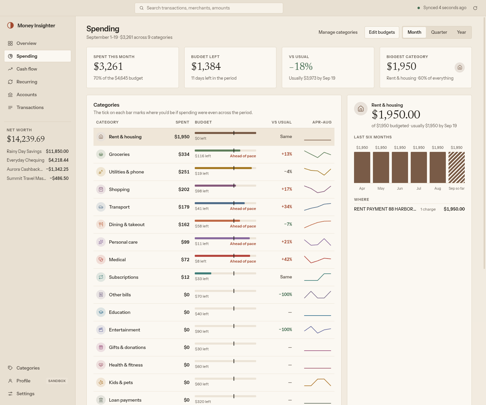</a><br><b>Spending</b><br><sub>Every category against its budget and against what you usually spend by today.</sub></td>
<td width="33%"><a href="https://xuckless.github.io/money-insighter/#tour-cash-flow">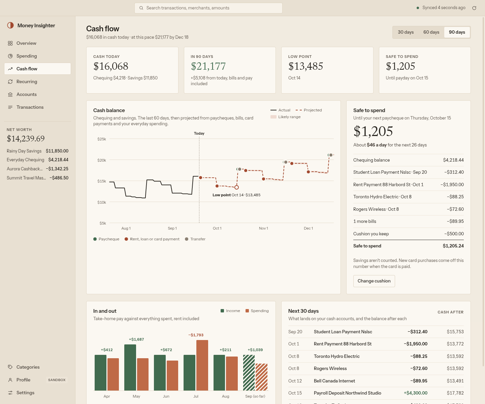</a><br><b>Cash flow</b><br><sub>Your balance projected forward, with the low point marked and a cushion you set.</sub></td>
<td width="33%"><a href="https://xuckless.github.io/money-insighter/#tour-recurring">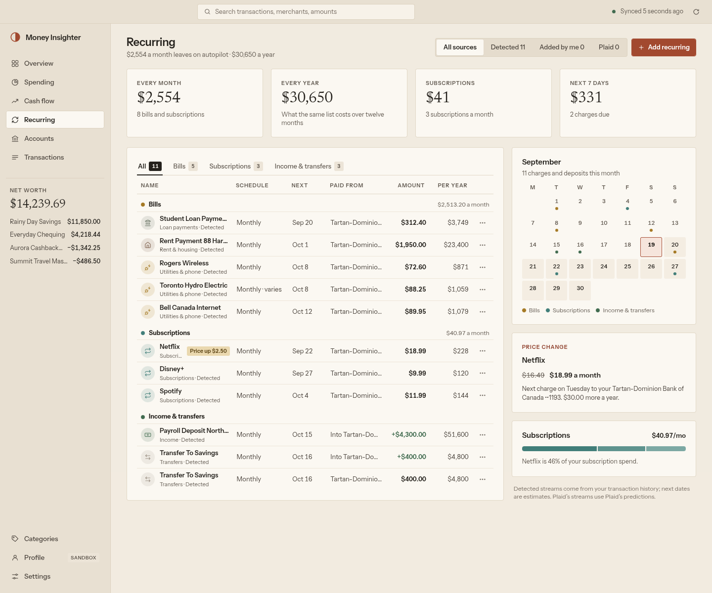</a><br><b>Recurring</b><br><sub>Bills and subscriptions found in your own history, price rises and all.</sub></td>
</tr>
</table>

---

## ⚡ Try it in five minutes

You do not need a bank, a credit card, or Plaid's approval. Plaid's **Sandbox**
is free and instant, and the app drives it end to end.

```sh
git clone https://github.com/xuckless/money-insighter
cd money-insighter/desktop
npm install
npm run dev
```

On the first screen, paste the **client ID** and **Sandbox secret** from
[dashboard.plaid.com](https://dashboard.plaid.com) → Developers → Keys. When
the app comes up, go to **Accounts → Add Sandbox item** and watch it fill.

> [!TIP]
> Prefer an installer? Grab the AppImage or the Windows `.exe` from
> [Releases](https://github.com/xuckless/money-insighter/releases). Builds are
> unsigned, so SmartScreen will warn you until a certificate is configured.

---

## ✨ What it does

Each claim below is followed by the thing that actually makes it true. If you
only want the pitch, read the bold lines; if you want the engineering, open
the arrows.

### 📉 See an overspend on the 11th, not the 30th

Spending is drawn against an **even pace of your budget**, so a category
running hot shows up while you can still do something about it. "vs usual"
compares you to what you had normally spent by this day of the month.


<details>
<summary><b>How it works</b></summary>

Only categories of kind `spending` are paced. Bills land on a schedule in
large amounts and would make the running total jump a thousand dollars on the
1st, hiding everyday spending underneath — so `isPaceCategory` in
`desktop/src/renderer/src/lib/insights/spending.ts` filters them out of the
pace line and the headline, while still budgeting them.

The numbers come from the topper's `categories/daily` and `categories/monthly`
views, which apply your category overrides and merchant rules **in SQL**
(`postgres-topper/internal/views/views.go`). That is why re-categorising one
transaction moves the pace chart, the budget bar, the sparkline and the
Overview headline together, without a refresh.

The projection cone is the same running total extended at your own recent
rate, which is why it narrows as the month goes on.
</details>

### 💵 Know what is safe to spend

Your cash balance is **projected forward** from the paycheques, bills and card
payments it already knows about. The low point is marked, and *Safe to spend*
subtracts a cushion you choose.


<details>
<summary><b>How it works</b></summary>

"Cash" means chequing plus savings — never cards. Card spending does not touch
cash until the card is paid, and that payment is itself a recurring stream, so
it enters the projection on its own date for its own amount. The logic is in
`desktop/src/renderer/src/lib/insights/cashflow.ts`, with flows signed from
your side: money in is positive.

The past 60 days of the line are worked back from today's balances through the
posted ledger, which is exact for bank accounts. Everything to the right of
today is the recurring streams below, laid onto their next dates.
</details>

### 🔁 Catch a subscription price rise before it bills

Recurring charges are found **in your own transaction history** — Plaid's paid
Recurring add-on is optional, not required — and a price change is flagged
before the next charge lands.


<details>
<summary><b>How it works</b></summary>

`lib/insights/detect.ts` does the same job Plaid's add-on does, locally: the
charges from one merchant, on one account, in one direction become a stream
when they land at a steady interval, for a steady amount, and the most recent
one is recent enough to still be alive.

A price change needs the last amount to differ from the average by at least 50
cents **and** at least 1% — two thresholds, because one alone flags either
rounding noise or nothing at all (`lib/insights/recurring.ts`).

Three sources are merged into one list by `loadStreams` in `lib/queries.ts`:
streams detected here, entries you added by hand, and Plaid's own streams when
you turn the add-on on. Marking something as not recurring hides it in
`recurring_hidden` rather than deleting anything.
</details>

### 🏷️ Fix a category once, not forty times

Re-categorise a transaction and you can set a rule for **every** transaction
from that merchant, backwards and forwards, in one move.

<details>
<summary><b>How it works</b></summary>

The rule is one row in `topper.merchant_rules`. The topper's
`transactions/categorized` view resolves a category in a fixed order — your
per-transaction override first, then your merchant rule, then Plaid's
`personal_finance_category` mapped through `topper.plaid_category` — all of it
in SQL (`postgres-topper/migrations/00003_categories.sql`).

Because the rule lives in the view rather than in the rows, nothing is
rewritten and nothing has to be re-synced. The next chart you open already
has it.
</details>

### 🗂️ Categories that are actually yours

Twenty-one to start with. Rename them, recolour them, add your own, and choose
where a removed category's transactions go.

<details>
<summary><b>How it works</b></summary>

They live in `topper.categories`, seeded with the built-in set that
`desktop/src/shared/categories.ts` mirrors, and are loaded once into a shared
hook. Each has a **kind** that decides its behaviour: `spending` is paced day
by day and budgeted, `bill` is budgeted but kept out of the daily pace,
`income` and `transfer` are neither — which is why a budget on Income is
refused by the API, not just hidden in the UI.

Removing a category merges its transactions into another one you pick; budgets
that pointed at it go with it.
</details>

### 🔎 Worth a look

A short list of what the app noticed: a price rise, a category ahead of pace,
transactions with no category yet, a balance heading somewhere uncomfortable.

<details>
<summary><b>How it works</b></summary>

`lib/insights/notes.ts` returns notes as **weighted runs of plain text** —
`"Netflix goes from $16.49 to "`, `{strong: "$18.99"}`, `{link: …}` — not
rendered strings. The rules stay unit-testable, and the page decides what a
strong run or a link looks like. Weight decides what surfaces first.
</details>

---

## 🔒 Your data stays yours

That sentence is on every finance app's landing page. Here is the part that
makes it structural rather than a promise.

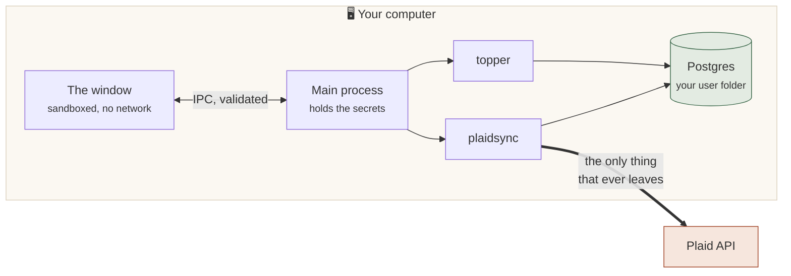

| What you are told | What makes it true |
|---|---|
| **Nothing leaves your computer but calls to Plaid.** | Thirteen Plaid endpoints are called, all from `plaid-backend-golang/internal/plaid/http.go`. There is no other outbound code path — no telemetry, no analytics, no crash reporting, and no update server (`publish: null` in `electron-builder.yml`). |
| **Your bank tokens are encrypted.** | AES-256-GCM, stored as `nonce(12) ‖ ciphertext ‖ tag(16)`, with the Plaid `item_id` as additional authenticated data — so a blob copied onto another item's row will not decrypt. Keys are versioned, so they can be rotated without a re-link. |
| **The app cannot move money.** | Plaid is asked for the `transactions` product only. There is no payment initiation and no transfer scope; there is nothing in the system that could authorise a movement of funds. |
| **Even the app cannot read its own tokens back.** | `encrypted_access_token` and `key_version` are on the REST layer's column denylist (`postgres-topper/internal/catalog/catalog.go`), so no query — including one you write yourself — can return them. |
| **The window is not trusted.** | The renderer runs with `sandbox: true`, context isolation and no Node, under a CSP of `default-src 'self'` — which is *why* the fonts are bundled rather than fetched. It reaches the services through four validated IPC channels and never holds a token, a port or a database URL. |
| **Writes are fenced in.** | IPC writes can reach seven of the app's own tables and no others (`writeTables` in `desktop/src/shared/api.ts`). A `DELETE` with no filter is refused in the main process before it goes anywhere. |
| **Your secrets are in the OS keyring.** | Everything sensitive is encrypted with Electron's `safeStorage`: libsecret or KWallet on Linux, DPAPI on Windows, Keychain on macOS. The database authenticates with `scram-sha-256` even over loopback. |
| **There is no account to breach.** | No sign-up, no password, no user record. The only credential in the system is your own Plaid key pair. |

> [!IMPORTANT]
> **Back up the encryption key.** After the first start the app shows the key
> that encrypts your bank access tokens and asks you to save it. It lives in
> your OS keyring; if that is ever lost, this key is the only way to read the
> connections you already made. Without it, you reconnect every bank.

---

## 🚀 Set it up in five minutes

<details open>
<summary><b>Sandbox — free, instant, no approval</b></summary>

**1. Get a Plaid account.** Sign up at
[dashboard.plaid.com](https://dashboard.plaid.com). Sandbox access is
immediate.

**2. Copy your keys.** Open **Developers → Keys**. You need the *client ID*
(the same in every environment) and the *Sandbox secret*. You do **not** need
to register a redirect URI, an allowed origin or a webhook URL — the app needs
none of them.

**3. Start the app** and paste them in.

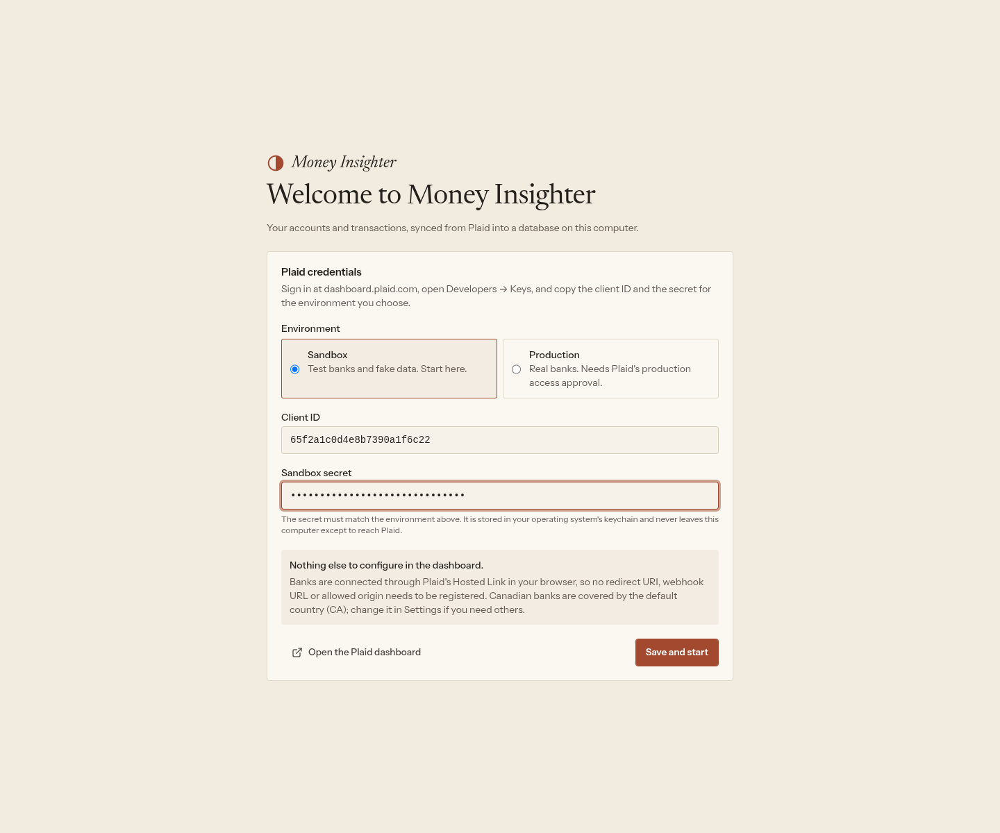

**4. Save the encryption key.** It appears once, before anything else. Put it
somewhere you would keep a password.

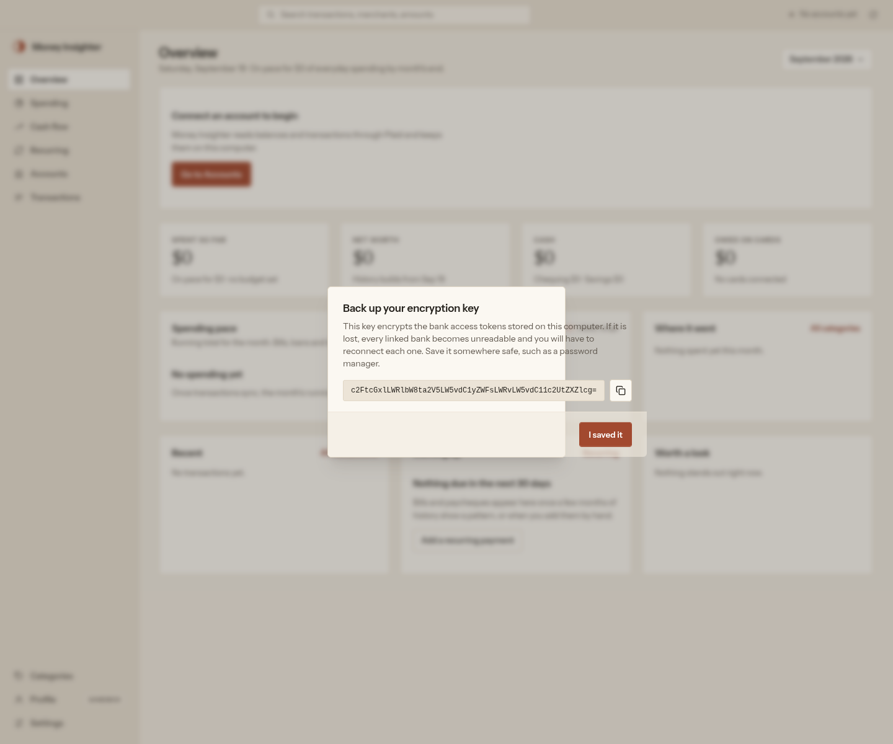

**5. Connect a test bank.** Either press **Connect an account** and sign in on
Plaid's page with `user_good` / `pass_good`, or press **Add Sandbox item** to
skip the browser entirely.

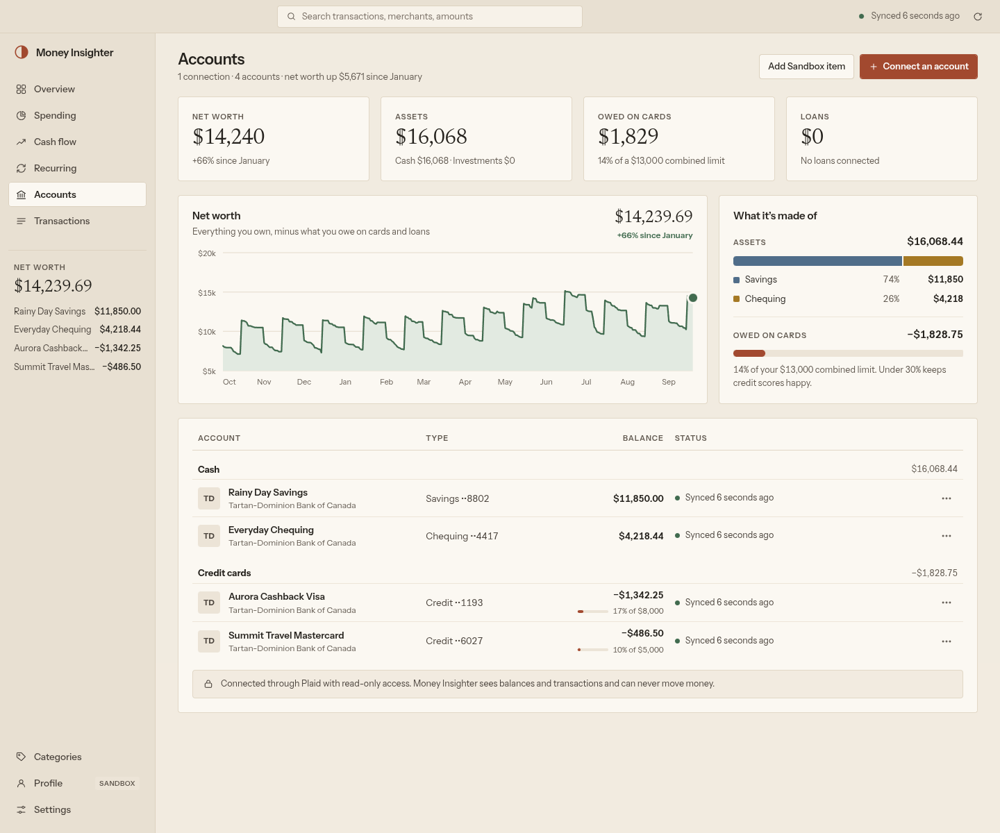

**6. Watch the first sync.** Every screen fills. After that it syncs hourly
while the app is open, and whenever you press sync.

</details>

<details>
<summary><b>Production — your real banks</b></summary>

Production access is a separate request on the same Plaid dashboard, and Plaid
charges per connected item.

**1. Get your Production secret** from Developers → Keys once you are approved.

**2. Open Profile**, switch the mode to Production and enter the secret. The
app keeps a secret **per mode**, so you enter each one only once and can
switch back without retyping.

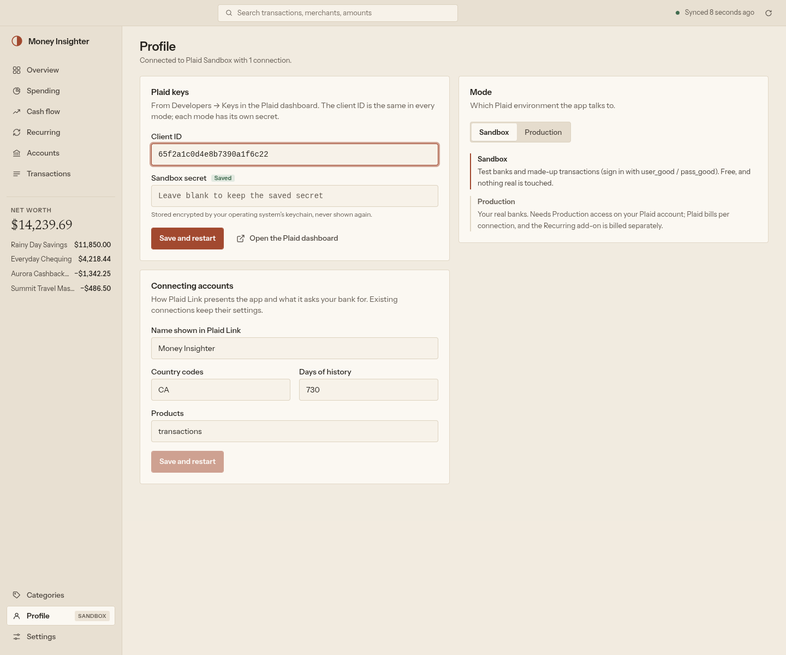

**3. Reconnect your banks.** Connections belong to the mode they were made in;
Sandbox items do not carry over, and the app refuses a switch when the
matching secret is missing rather than failing later.

**4. Connect for real.** Linking uses Plaid **Hosted Link** — Plaid's own page
in your own browser. Because Link never runs inside the app, OAuth
institutions (CIBC among them) work in Production, where Plaid requires HTTPS
redirect URIs that a desktop app cannot serve.

> [!NOTE]
> Plaid's Trial plan allows ten Production items; Sandbox items never count
> against it. **Remove** on a connection calls `/item/remove`, which does not
> free a Trial slot.

</details>

<details>
<summary><b>Where your data lives, and how to start over</b></summary>

Everything is in Electron's user-data directory —
`~/.config/money-insighter` on Linux, `%APPDATA%\money-insighter` on Windows:

```
config.json     settings that are not secret
secrets.bin     everything that is, encrypted with the OS keyring (mode 0600)
postgres/       the database cluster
logs/           one file per local service
```

**Settings → Open folder** takes you there. To start over: quit the app and
delete that directory, or point `MONEY_INSIGHTER_DATA_DIR` somewhere else.

</details>

---

## 🧱 How it is built

An Electron shell around two Go services and an embedded Postgres.

| | | |
|---|---|---|
| **`plaid-backend-golang/`** | `plaidsync` | Owns the Plaid relationship: Hosted Link sessions, token exchange, the sync engine and a job queue. Writes normalised accounts and transactions into Postgres, and is the only thing that ever talks to Plaid. |
| **`postgres-topper/`** | `topper` | The REST access layer over that database: read-only access to plaidsync's tables and views, read-write consumer tables in schema `topper`. |
| **`desktop/`** | the app | Starts Postgres, plaidsync and the topper on loopback ports, keeps the secrets in the OS keychain, and renders the UI. The renderer never holds a token. |

**The services never call each other. The database is the integration point.**
Each Go directory is its own module with its own README, `.env.example`,
Makefile and tests; `go.work` at the root lets editors see both.

<details>
<summary><b>Connecting a bank, end to end</b></summary>

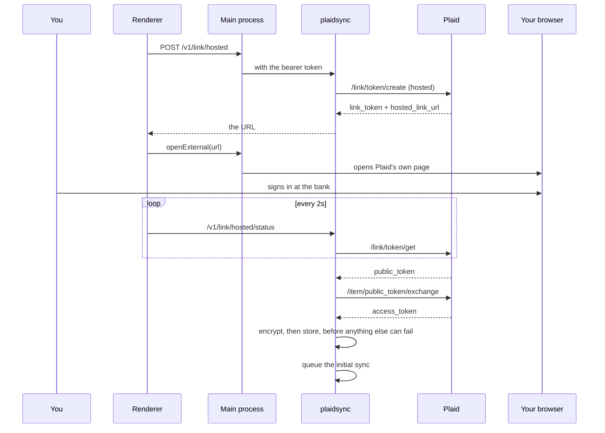

Link never runs inside the app, which is why no redirect URI, allowed origin
or webhook URL has to be registered anywhere. The link token travels in the
request *body* on the status route, so it never lands in an access log.

</details>

<details>
<summary><b>What a sync does</b></summary>

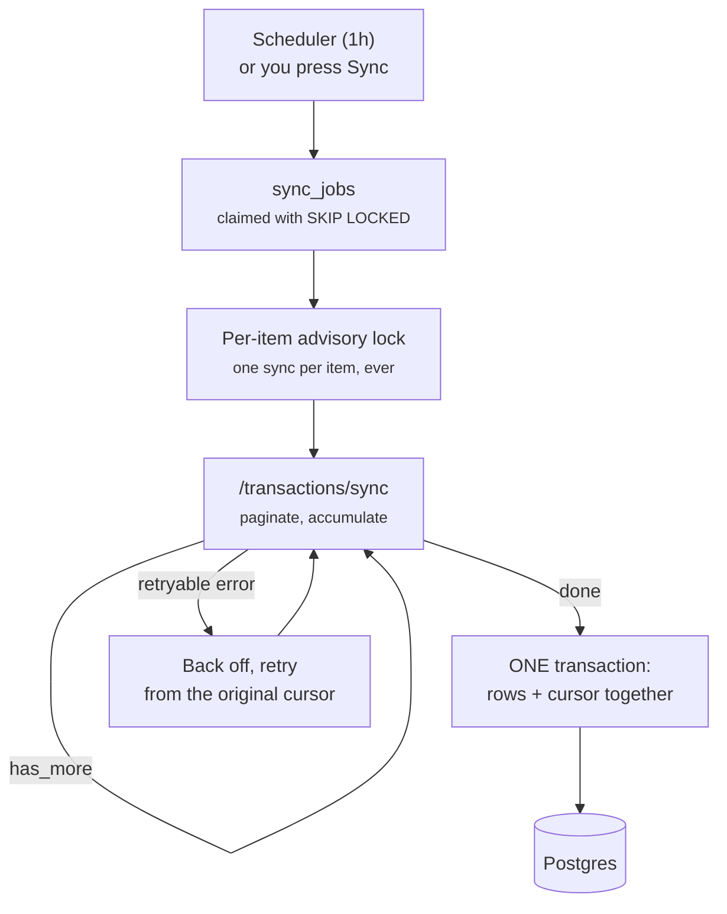

The cursor is never advanced on its own. Rows and the cursor commit in a single
transaction, only once Plaid says there is no more — so a crash mid-pagination
loses nothing and repeats nothing. Transactions are soft-deleted, never
`DELETE`d, and a pending row is superseded rather than replaced.

There are no webhooks: a laptop has no public URL. plaidsync syncs on a
schedule instead (the app sets 1 h; plaidsync's own default is 6 h), with a
paced follow-up — 15s, 30s, 1m, 2m, then 5m — when Plaid says the data is not
ready yet.

</details>

---

## 🛠️ Running from source

Prerequisites: **Go 1.26**, **Node 22**, and for the Go test suites Docker with
Compose (the development Postgres on `127.0.0.1:5433`).

```sh
cd desktop
npm install
npm run dev          # cross-compiles plaidsync and topper, then starts Electron
```

Checks:

```sh
cd plaid-backend-golang && make check && make test-db && make test-sandbox   # the last needs Sandbox keys in .env
cd postgres-topper     && make check && make test-db
cd desktop             && npm run typecheck && npm run lint && npm test
```

End to end, against Plaid Sandbox:

```sh
cd desktop
npm run build
PLAID_CLIENT_ID=... PLAID_SECRET=... npm run smoke          # asserts the whole path
PLAID_CLIENT_ID=... PLAID_SECRET=... npm run capture:docs   # re-takes the screenshots
```

### Building installers

```sh
cd desktop
npm run dist:linux   # AppImage and .deb in desktop/dist/
npm run dist:win     # NSIS installer; cross-builds on Linux (Wine is not needed)
npm run dist:mac     # DMG; macOS only
npm run dist         # Linux and Windows
```

Each installer bundles the Go binaries for its platform
(`scripts/build-go.mjs`) and the Postgres binaries for its platform (the
`@embedded-postgres/<platform>` npm package; `scripts/fetch-postgres.mjs` pulls
one npm would skip on this host).

Released macOS builds are signed with a Developer ID certificate and notarized
by Apple, so they open without a Gatekeeper warning; the Release workflow does
that on a macOS runner, and `desktop/README.md` lists the secrets it needs. A
local `npm run dist:mac` without a certificate produces an unsigned app.
Windows installers are not signed, so SmartScreen warns until the installer
accrues reputation.

### Notes for working on it

- The Go services are unchanged by the desktop app: they still read their
  configuration from the environment, which the app's supervisor builds from
  `config.json` and the decrypted secrets. Run them by hand with `make run` in
  each directory when working on them alone.
- plaidsync's `PLAIDSYNC_REDIRECT_URI` and `PLAIDSYNC_WEBHOOK_URL` remain for a
  deployment that runs Plaid Link itself or has a public URL; the app sets
  neither.
- The renderer reaches the services only through `window.api` (see
  `desktop/src/shared/api.ts`); the main process validates every request and
  holds the tokens.
- The website is `docs/`, published to GitHub Pages; the screenshots and its
  chart data are generated. See [`docs/README.md`](docs/README.md).

---

## 🚧 Honest limitations

It is a beta, and these are the things it does not do yet. They are tracked in
[`desktop/TODO.md`](desktop/TODO.md) with what already exists to build on.

- **Light theme only.** The palette is not defined for dark yet.
- **No net-worth history before your first sync.** Balance snapshots start the
  day you link; nothing is backfilled. Cash flow works its cash line back
  through transactions, but investments cannot be reconstructed that way.
- **No multi-currency conversion.** Accounts in another currency are listed but
  left out of totals and charts.
- **No investment holdings.** Balances only — Plaid's Investments product is
  not wired up.
- **Tuned for ≥1280px.** Below 1024px (the window minimum) is untested.
- **No OS notifications.** A price rise or a low projected balance is only
  shown while the app is open.
- **Windows installers are unsigned**, so SmartScreen warns on first run.
  macOS builds are signed and notarized.
- **Semi-monthly pay reads as biweekly**, and a detected stream cannot yet be
  corrected in place — only hidden or replaced by a manual entry.

---

## 📄 Licence

Source-available. The code is published so that you can read it, build it, run
it and check the claims on this page for yourself — which is rather the point
of an app that asks for your bank data. It is not released under an
open-source licence, and it is not relicensed for redistribution.

Not affiliated with Plaid.
